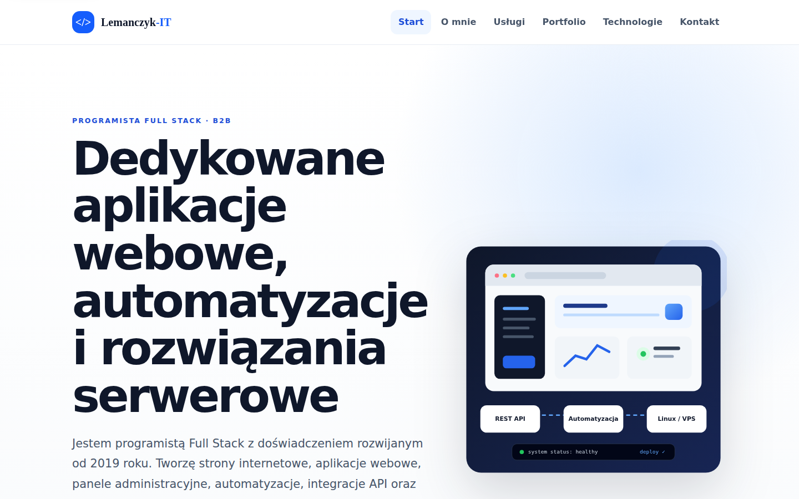
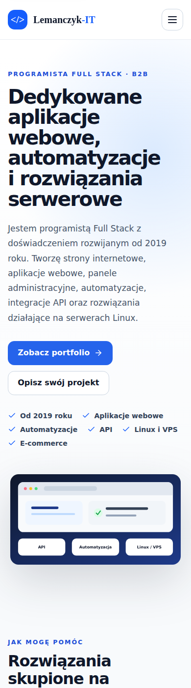

# Lemanczyk-IT Website

Profesjonalna strona ofertowa Lemanczyk-IT, zbudowana z naciskiem na wydajność, dostępność, SEO i bezpieczną obsługę kontaktu. Wersja produkcyjna działa pod adresem [lemanczyk-it.pl](https://lemanczyk-it.pl).

## Podgląd

| Desktop | Mobile |
| --- | --- |
|  |  |

## Najważniejsze funkcje

- osobne, indeksowalne podstrony oferty, portfolio, technologii i kontaktu;
- responsywna nawigacja ze sticky headerem i pełną obsługą klawiatury;
- dedykowane warianty ilustracji hero dla desktopu i mobile;
- portfolio z bezpiecznymi linkami do publicznych realizacji i profili;
- formularz kontaktowy z walidacją backendową, honeypotem i rate limitingiem;
- uwierzytelniona wysyłka SMTP z konfiguracją poza repozytorium;
- statyczne dokumenty HTML dla robotów oraz strona 404.

## Podstrony

`/`, `/o-mnie`, `/uslugi`, `/portfolio`, `/technologie`, `/kontakt`, `/polityka-prywatnosci` oraz `/dane-firmy`.

## Technologie

- React 18, TypeScript i React Router;
- Vite 6 i Tailwind CSS;
- PHP 8 dla endpointu kontaktowego;
- lokalne SVG, semantyczny HTML i CSS;
- nginx i Linux w środowisku produkcyjnym.

## SEO

Każda publiczna trasa ma unikalny tytuł, opis, canonical, Open Graph i logiczny nagłówek H1. Projekt zawiera `sitemap.xml`, `robots.txt`, JSON-LD, manifest, favicony oraz statyczne fallbacki HTML generowane podczas buildu.

## Dostępność

Interfejs zapewnia skip link, widoczne focus states, etykiety formularza, semantyczną nawigację, sterowanie menu klawiaturą, obsługę Escape i `prefers-reduced-motion`. Ilustracje mają określone wymiary, co ogranicza CLS.

## Bezpieczeństwo

Endpoint kontaktowy ustala odbiorcę po stronie serwera, odrzuca próby wstrzyknięcia nagłówków, ogranicza długość pól i częstotliwość wysyłki oraz zwraca kontrolowane komunikaty. Hasło SMTP nigdy nie trafia do kodu, frontendu ani GitHub Actions.

## Formularz kontaktowy

Mailer używa SMTP submission przez STARTTLS. `.env.example` dokumentuje wyłącznie nazwy wymaganych ustawień. Produkcyjna konfiguracja jest przechowywana poza repozytorium z uprawnieniami `0600`. Pole `From` należy do domeny serwisu, adres klienta trafia do `Reply-To`, a odbiorca jest stały.

## Uruchomienie lokalne

Wymagane są Node.js 20+, npm oraz PHP 8 z rozszerzeniem `mbstring`.

```bash
npm ci
npm run dev
```

Serwer deweloperski Vite wyświetli adres lokalny. Formularz wymaga osobnego, lokalnego endpointu PHP lub mocka — nie należy kopiować sekretów produkcyjnych.

## Build

```bash
npm run build
```

Polecenie buduje zasoby Vite, generuje statyczne dokumenty publicznych tras i kopiuje bezpieczne pliki endpointu do `dist/`.

## Testy

```bash
npm test
```

Zestaw obejmuje build, kontrolę SEO i plików technicznych, regresje UI, lint PHP oraz testy formularza z mockowanymi błędami SMTP (timeout, uwierzytelnienie i niedostępny serwer).

## Deployment

Produkcja korzysta z atomowych wydań i symlinkowanego katalogu bieżącej wersji. Nowy build jest weryfikowany przed przełączeniem, a poprzednie wydanie pozostaje dostępne do rollbacku. Szczegóły infrastruktury i sekrety nie są częścią repozytorium.

## GitHub Actions

Workflow CI uruchamia instalację zależności, build, testy, kontrolę składni, podstawowy secret scan oraz `git diff --check`. CI nie wykonuje automatycznego wdrożenia produkcyjnego.

## Lighthouse

Przed wydaniem sprawdzane są warianty mobile i desktop pod kątem Performance, Accessibility, Best Practices i SEO. Wyniki zależą od środowiska testowego i są dokumentowane w raporcie konkretnego wdrożenia.

## Autor

Projekt rozwija Michał Lemanczyk — [profil GitHub Divithy-IT](https://github.com/Divithy-IT).

## Prawa

Source code available for portfolio and educational review. All rights reserved.
